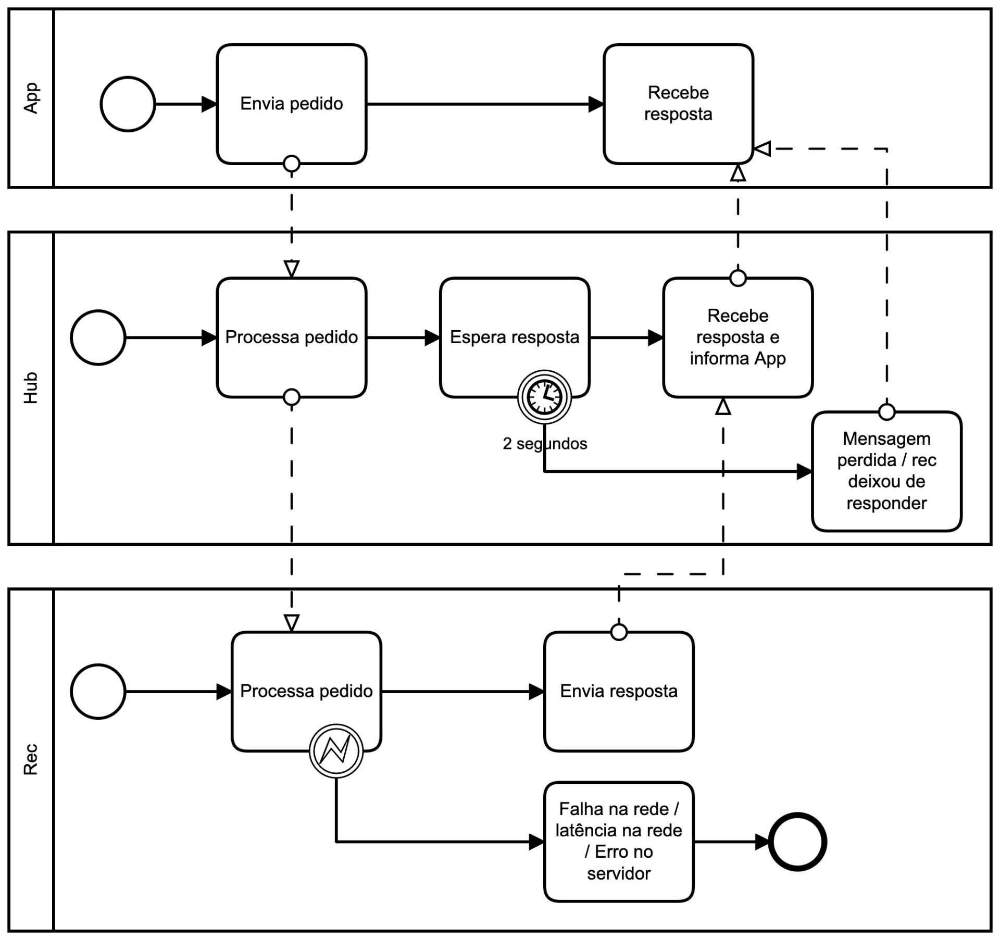

# Relatório do projeto *Bicloin*

Sistemas Distribuídos 2020-2021, segundo semestre

## Autores

**Grupo A01**

| Número | Nome              | Utilizador                       | Correio eletrónico                  |
| -------|-------------------|----------------------------------| ------------------------------------|
| 91029  | André Dias        | <https://github.com/andrebastosdias> | <mailto:andrebastosdias@tecnico.ulisboa.pt> |
| 93696  | Daniel Lopes      | <https://github.com/danielquintas8> | <mailto:daniel.quintas.lopes@tecnico.ulisboa.pt> |
| 93750  | Ricardo Andrade   | <https://github.com/rfssAndrade> | <mailto:ricardo.s.andrade@tecnico.ulisboa.pt> |

  

## Melhorias da primeira parte

- [Alteração da representação das coordenadas](https://git.rnl.tecnico.ulisboa.pt/SD-20-21-2/A01-Bicloin/commit/3c7b9cd470a142a4b0f150a35b9f1ce756902f64)
- [Alteração do sync no rec](https://git.rnl.tecnico.ulisboa.pt/SD-20-21-2/A01-Bicloin/commit/3c7b9cd470a142a4b0f150a35b9f1ce756902f64)

## Modelo de faltas

O modelo de faltas definido suporta as seguintes faltas:
- **Faltas de servidores rec**: assumindo que existindo 2f + 1 servidores rec, são suportadas f faltas em servidores rec, de modo a garantir a coerência dos dados e satisfazer o quórum mínimo (f + 1) necessário para garantir que as leituras ou escritas são corretas.

- **Recuperação de servidores rec**: se um dos servidores rec falhou, a sua recuperação é feita de forma impercetível para o utilizador. O rec recuperado é reatualizado à medida que novas escritas são efetuadas.

- **Delay na resposta a pedidos**: os servidores rec funcionam de forma assíncrona. Em caso de demora na receção de uma mensagem, a instância hub espera 2 segundos pela resposta.

- **Perda de mensagens**: se a resposta a um pedido não chegar no tempo determinado, a mensagem considera-se perdida e a App é informada dessa ocorrência.

- **Unbind no ZooKeeper**: o rec suporta falhas nas réplicas seja feito ou não unbind desta no ZooKeeper.

O modelo de faltas definido não suporta as seguintes faltas:
- **Qualquer falta no servidor de nomes ZooKeeper**
- **Qualquer falta no processamento de procedimentos remotos do servidor hub**
- **Faltas densas**

## Solução

Na nossa solução, a tolerância a faltas é implementada de forma opaca à App. A App envia um pedido para o hub para
qualquer comando válido introduzido por um utlizador. Por sua vez, o hub processa o pedido e, verificando que os
dados recebidos estão corretos, faz pedidos de read e/ou write para o rec. Para tolerar possíveis faltas no rec,
o hub aguarda dois segundos por uma resposta do rec. Se o rec responder dentro do tempo determinado (falta por
latência na rede, por exemplo), o hub informa a App do resultado da operação. Findo o tempo determinado (falta por
perda de mensagem na rede ou erro no servidor rec, por exemplo), o hub informa a App de um erro no processamento do
pedido.

Quando o hub faz um pedido através do RecordApi, este começa por tentar conectar-se a instâncias rec em falta. De seguida,
envia, sequencialmente, pedidos a todas as intâncias do rec e inicializa um Observer para a receção das respostas.
Quando recebe uma resposta, o coletor de respostas é atualizado. Caso o pedido tenha sido realizado com sucesso, este
incrementa um contador e guarda o valor, se a tag for superior. Caso o pedido não tenha sido realizado com sucesso
ou o temporizador de 2 segundos seja atingido, é incrementado um outro contador e a instância que enviou a resposta
é marcada como em falta. Quando um dos contadores atinge o quórum, é enviada uma resposta ao hub, em caso de sucesso,
com o valor correspondente à tag mais elevada. Quando o pedido feito pelo hub é de escrita, é realizada primeiro uma
leitura através do mesmo processo. Respostas posteriores ao quórum ser atingido são ignoradas.

## Protocolo de replicação

Protocolo Registo Coerente -
Versão múltiplos escritores/ múltiplos leitores

Neste protocolo utilizou-se uma tag composta por duas variáveis:
* **seq -** número de sequência da escrita que deu origem à versão
* **cid -** identificador do cliente que escreveu essa versão

No contexto deste projeto, **seq** é um incremental, e o **cid** é o path do hub que efetua o pedido.

* Comparação das variáveis referidas. **tag1** maior que **tag2** se:
    * **seq1** > **seq2**, ou
    * **seq1** = **seq2** e **cid1** > **cid2**

Portanto: comparamos sempre o **seq** primeito e, em caso de empate, o **cid** serve para desempatar.

* Leituras:
    * Hub:
        * Faz o pedido de leitura em todas as réplicas do rec: **read()**
        * Aguarda por resposta de um quórum (ou seja, **⌊f / 2⌋+1**)
        * Guarda o valor associado à maior **tag** e **cid**
        * Retorna o valor guardado no passo anterior.

    * Réplica do Rec:
        * Ao receber um pedido de leitura, responde ao Hub com **< value, seq, cid >**.

* Escritas:
    * Hub:
        * Executa a leitura (descrita no ponto anterior) para obter o maior valor de tag **maxTag = < seq, cid >**
        * **newTag = < seq+1, hub_id>**
        * Faz o pedido de escrita em todas as réplicas do rec: **write(value, newTag)**
        * Aguarda por ACK's de um quórum (ou seja, **⌊f / 2⌋+1**)
        * Retorna à App que o pedido foi concluído com sucesso.

    * Réplica do Rec:
        * Ao receber um pedido de escrita **write(value, newTag)**, se **newTag > tag** (atual), atualiza o valor.

A denominação de tag é meramente para efeitos de explicação, no código implementado são
utilizadas duas variáveis separadas.

## Medições de desempenho

| Otimização    | Falhas | Read (ms)  | Write (ms) |
| ------------- | ------ | ---------: |----------: |
| Não otimizado | Não    | 136.196    | 313.738    |
| Não otimizado | Sim    | 131.325    | 305.290    |
| Otimizado     | Não    | 25.381     | 32.830     |
| Otimizado     | Sim    | 112.525    | 132.619    |

Para obtenção dos tempos de desempenho das operações ``read`` e ``write``, foram utilizados os testes do ``rec-tester``.
Estes testes efetuam 105 leituras e 95 escritas. Os testes foram realizados com 5 réplicas (consequentemente quórum 3)
onde os com falhas tinham 2 dessas 5 réplicas inativas. É possível verificar que houve uma melhoria significativa
de desempenho, principalmente na versão otimizada. A justificação dos resultados de tempo será
explícita na secção seguinte.

## Opções de implementação

### Quórum e pesos
Neste protocolo de replicação existe a possibilidade de atribuir diferentes pesos às diferentes réplicas
do servidor, permitindo assim dar mais importância a réplicas mais fiáveis, com melhor conectividade e/ou com maior
desempenho computacional. Visto que neste projeto as réplicas são executadas todas na mesma máquina e não existe
uma relação de causalidade para a probabilidade de cada réplica falhar (é uma mera escolha do utilizador), não houve
motivos para diferenciar as réplicas com pesos diferentes.

Outra opção seria atribuir quorums diferentes às operações de leitura e escrita, desde que a soma destes fosse superior
ao número de réplicas. Contudo, visto que é especificado que metade das réplicas (menos uma) podem falhar, ao dar
um quórum superior a metade das réplicas à operação de escrita, esta podia nunca obter o quórum completo, comprometendo
a disponibilidade do servidor em casos extremos. Embora o desempenho do servidor pudesse melhorar um pouco, visto que
são feitas mais leituras que escritas, a perda de disponibilidade do servidor num protocolo de Registo Coerente seria
um problema.

### ZooKeeper e medições de tempo
A principal otimização feita foi na recuperação de réplicas. Numa primeira versão, em todos os pedidos recebidos no
recordAPI, o HashMap de instâncias era re-preenchido com os valores adquiridos no ZooKeeper. Desta maneira, réplicas
perdidas seriam retiradas do mapa e réplicas recuperadas seriam introduzidas no mapa. Após algum estudo dos valores de
tempo, verificou-se que cerca de 80% do tempo do pedido era usado no pedido feito ao ZooKeeper com as informações das
réplicas.

Para contrariar isto, e sabendo que as réplicas mantém sempre o mesmo nome no ZooKeeper, decidiu-se implementar um HashSet
onde são adicionados os nomes das réplicas que falham em algum pedido. Se este set estiver vazio (todas as réplicas
estão ativas), não é feito nenhum pedido ao ZooKeeper, daí os baixos valores de tempo medidos nos testes otimizados
sem falhas. Quando há réplicas no set, apenas estas são atualizadas, diminuindo o valor tempo necessário na versão otimizada
com falhas em comparação com a versão não otimizada.

Outra otimização possível para casos em que há falhas, seria ter uma thread que tem como única função
ficar à escuta do ZooKeeper a tentar recuperar réplicas perdidas e reintroduzi-las no mapa quando
recuperadas.
